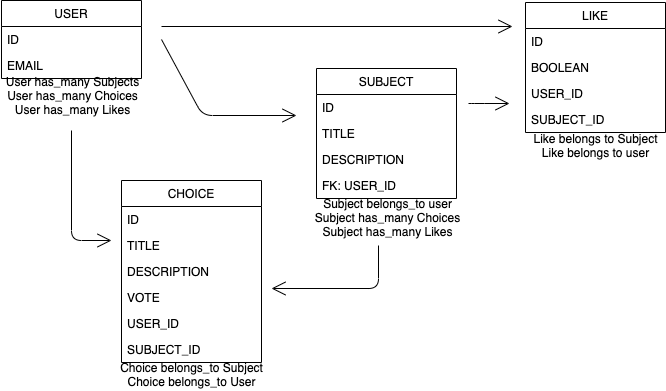

# Poll Position API

[Deployed API](https://salty-cliffs-30565.herokuapp.com/)

[Deployed Client](https://gmorse19.github.io/PollPosition/)

[Client Repo](https://github.com/GMorse19/PollPosition)

## ERD




### Subjects Endpoints and Curl Scripts

| Verb   | URI Pattern            | Controller#Action |
|--------|------------------------|-------------------|
| POST   | `/subjects`            | `subjects#create` |
| GET    | `/subjects`            | `subjects#index`  |
| GET    | `/subjects/:id`        | `subjects#show`   |
| DELETE | `/subjects/:id`        | `subject#destroy` |
| PATCH  | `/subjects/:id`        | `subject#update`  |

#### POST /create

Request:

```sh
curl "http://localhost:4741/subjects" \
  --include \
  --request POST \
  --header "Content-Type: application/json" \
  --header "Authorization: Token token=${TOKEN}" \
  --data '{
    "subject": {
      "title": "'"${TITLE}"'",
      "description": "'"${DESCRIPTION}"'"
    }
  }'
```
```sh
TOKEN="xxxxxxxxx" TITLE="Title" DESCRIPTION="Description" sh curl-scripts/subjects/create.sh
```

Response:

```md
HTTP/1.1 201 Created
Content-Type: application/json; charset=utf-8

{
  "subject": {
    "id": 1,
    "title": "Title",
    "description": "Description"
  }
}
```
### Authentication Endpoints and Curl Scripts

| Verb   | URI Pattern            | Controller#Action |
|--------|------------------------|-------------------|
| POST   | `/sign-up`             | `users#signup`    |
| POST   | `/sign-in`             | `users#signin`    |
| PATCH  | `/change-password`     | `users#changepw`  |
| DELETE | `/sign-out`        | `users#signout`   |

#### POST /sign-up

Request:

```sh
curl http://localhost:4741/sign-up \
  --include \
  --request POST \
  --header "Content-Type: application/json" \
  --data '{
    "credentials": {
      "email": "'"${EMAIL}"'",
      "password": "'"${PASSWORD}"'",
      "password_confirmation": "'"${PASSWORD}"'"
    }
  }'
```

```sh
EMAIL=ava@bob.com PASSWORD=hannah curl-scripts/auth/sign-up.sh
```

Response:

```md
HTTP/1.1 201 Created
Content-Type: application/json; charset=utf-8

{
  "user": {
    "id": 1,
    "email": "ava@bob.com"
  }
}
```

#### POST /sign-in

Request:

```sh
curl http://localhost:4741/sign-in \
  --include \
  --request POST \
  --header "Content-Type: application/json" \
  --data '{
    "credentials": {
      "email": "'"${EMAIL}"'",
      "password": "'"${PASSWORD}"'"
    }
  }'
```

```sh
EMAIL=ava@bob.com PASSWORD=hannah curl-scripts/auth/sign-in.sh
```

Response:

```md
HTTP/1.1 200 OK
Content-Type: application/json; charset=utf-8

{
  "user": {
    "id": 1,
    "email": "ava@bob.com",
    "token": "BAhJIiVlZDIwZTMzMzQzODg5NTBmYjZlNjRlZDZlNzYxYzU2ZAY6BkVG--7e7f77f974edcf5e4887b56918f34cd9fe293b9f"
  }
}
```

#### PATCH /change-password

Request:

```sh
curl --include --request PATCH "http://localhost:4741/change-password" \
  --header "Authorization: Token token=$TOKEN" \
  --header "Content-Type: application/json" \
  --data '{
    "passwords": {
      "old": "'"${OLDPW}"'",
      "new": "'"${NEWPW}"'"
    }
  }'
```

```sh
OLDPW='hannah' NEWPW='elle' TOKEN='BAhJIiVlZDIwZTMzMzQzODg5NTBmYjZlNjRlZDZlNzYxYzU2ZAY6BkVG--7e7f77f974edcf5e4887b56918f34cd9fe293b9f' sh curl-scripts/auth/change-password.sh
```

Response:

```md
HTTP/1.1 204 No Content
```

#### DELETE /sign-out

Request:

```sh
curl http://localhost:4741/sign-out \
  --include \
  --request DELETE \
  --header "Authorization: Token token=$TOKEN"
```

```sh
TOKEN='BAhJIiVlZDIwZTMzMzQzODg5NTBmYjZlNjRlZDZlNzYxYzU2ZAY6BkVG--7e7f77f974edcf5e4887b56918f34cd9fe293b9f' sh curl-scripts/auth/sign-out.sh
```

Response:

```md
HTTP/1.1 204 No Content
```


## [License](LICENSE)

1.  All content is licensed under a CC­BY­NC­SA 4.0 license.
1.  All software code is licensed under GNU GPLv3. For commercial use or
    alternative licensing, please contact legal@ga.co.
